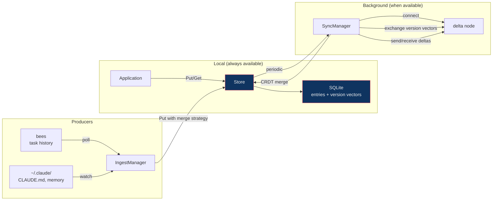
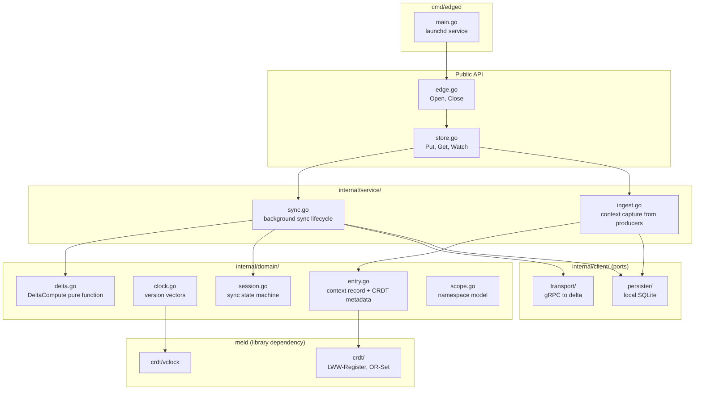
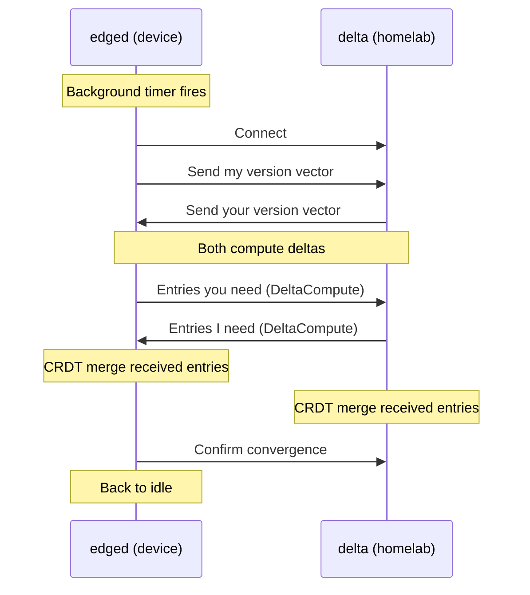

# edge

Embeddable local-first database with CRDT sync.

Go library with a thin host daemon (edged). The library provides Open, Put, Get, Watch, Close. The daemon embeds the library, watches files, polls bees, and syncs to delta in the background. edged runs as a launchd service: starts on login, runs forever, restarts on crash. One-time setup, then invisible.

Reads and writes are local SQLite operations. Sync happens in the background when a delta node is reachable. Offline is the default mode, not a degradation.

## Public API

```go
store, err := edge.Open("/path/to/data.db")

store.Put(ctx, "user/prefs/theme", []byte("dark"), edge.LWW)
val, err := store.Get(ctx, "user/prefs/theme")

events, err := store.Watch(ctx, edge.Scope{Project: "tally"})

store.Close()
```

That is the API. If it grows beyond Open, Put, Get, Watch, Close, the abstraction has failed.

## Data Flow



## Architecture



## Sync Session



If sync is interrupted mid-delta, version vectors track what was confirmed. Next sync resumes from last confirmed vector.

## Merge Strategies

| Context type | CRDT         | Why                                                 |
| ------------ | ------------ | --------------------------------------------------- |
| Preferences  | LWW-Register | Most recent setting wins                            |
| Corrections  | LWW-Register | Latest correction supersedes                        |
| Patterns     | OR-Set       | Patterns accumulate, never lost                     |
| Task history | Append-only  | Events are immutable facts                          |
| Files (V1)   | LWW per file | Simplest. Concurrent file edits rare across devices |

## Seven Ideals

| Ideal                  | How edge satisfies it                                                        |
| ---------------------- | ---------------------------------------------------------------------------- |
| No spinners            | Reads and writes are local SQLite. Instant.                                  |
| Multi-device           | CRDT sync via delta relay.                                                   |
| Network optional       | Full functionality offline. Sync when available.                             |
| Seamless collaboration | CRDTs resolve concurrent edits automatically.                                |
| The Long Now           | Data outlives any server or service. No server required to access your data. |
| Privacy by default     | Data lives on the user's device.                                             |
| User ownership         | User controls and owns their data.                                           |

## Dependencies

- **meld**: CRDT types, version vectors, delta-state computation. Must be complete.
- **delta**: sync relay endpoint. Must have sync handler.

Observability via Telemetry port (OTel).
