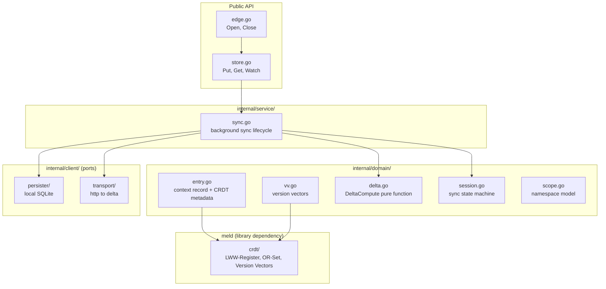
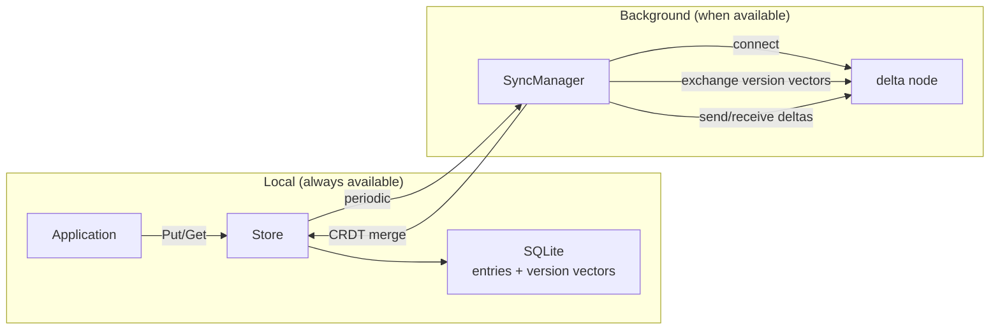
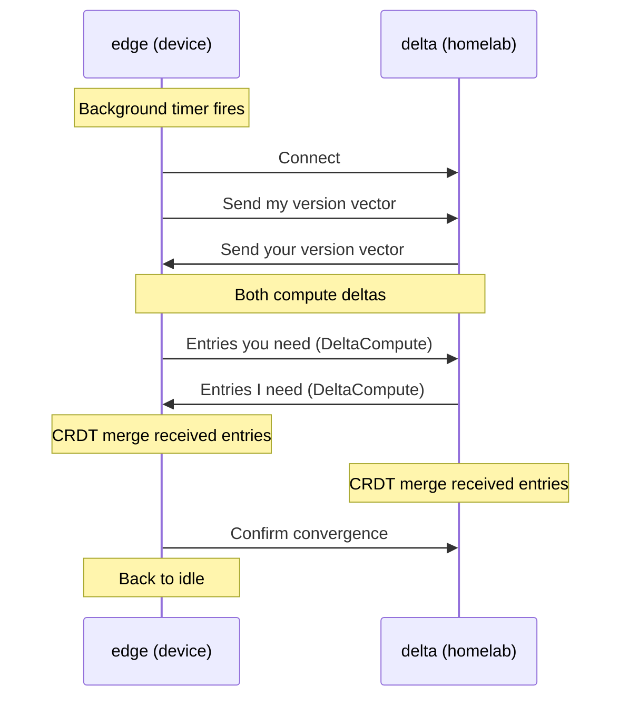

# edge

Embeddable local-first database with CRDT sync.

Go library. Import edge and embed in your application. Reads and writes are local SQLite operations. Sync happens in the background when a delta node is reachable. Offline is the default mode, not a degradation.

## Public API

```go
store, err := edge.Open("/path/to/data.db")

store.Put(ctx, "user/prefs/theme", []byte("dark"), edge.LWW)
val, err := store.Get(ctx, "user/prefs/theme")

events, err := store.Watch(ctx, edge.Scope{Project: "tally"})

store.Close()
```

That is the API. If it grows beyond Open, Put, Get, Watch, Close, the abstraction has failed.

## Architecture



## Data Flow



## Sync Session



If sync is interrupted mid-delta, version vectors track what was confirmed. Next sync resumes from last confirmed vector.

## Merge Strategies

| Data type     | CRDT         | Why                             |
| ------------- | ------------ | ------------------------------- |
| Settings      | LWW-Register | Most recent value wins          |
| Collections   | OR-Set       | Elements accumulate, never lost |
| Event history | Append-only  | Events are immutable facts      |

## Seven Ideals

| Ideal                  | How edge satisfies it                                                        |
| ---------------------- | ---------------------------------------------------------------------------- |
| No spinners            | Reads and writes are local SQLite. Instant.                                  |
| Multi-device           | CRDT sync via delta relay.                                                   |
| Network optional       | Full functionality offline. Sync when available.                             |
| Seamless collaboration | CRDTs resolve concurrent edits automatically.                                |
| The Long Now           | Data outlives any server or service. No server required to access your data. |
| Privacy by default     | Data lives on the user's device.                                             |
| User ownership         | User controls and owns their data.                                           |
